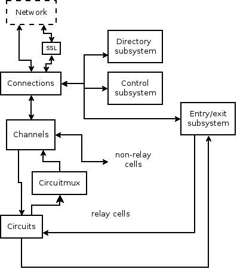
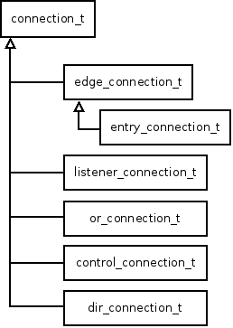

## Data flow in the Tor process ##

We read bytes from the network, we write bytes to the network.  For the
most part, the bytes we write correspond roughly to bytes we have read,
with bits of cryptography added in.

The rest is a matter of details.

### Connections and buffers: reading, writing, and interpreting. ###

At a low level, Tor's networking code is based on "connections".  Each
connection represents an object that can send or receive network-like
events.  For the most part, each connection has a single underlying TCP
stream (I'll discuss counterexamples below).

A connection that behaves like a TCP stream has an input buffer and an
output buffer.  Incoming data is
written into the input buffer ("inbuf"); data to be written to the
network is queued on an output buffer ("outbuf").

Buffers are implemented in buffers.c.  Each of these buffers is
implemented as a linked queue of memory extents, in the style of classic
BSD mbufs, or Linux skbufs.

A connection's reading and writing can be enabled or disabled.  Under
the hood, this fuctionality is implemented using libevent events: one
for reading, one for writing.  These events are turned on/off in
main.c, in the functions connection_{start,stop}_{reading,writing}.

When a read or write event is turned on, the main libevent loop polls
the kernel, asking which sockets are ready to read or write.  (This
polling happens in the event_base_loop() call in run_main_loop_once()
in main.c.)  When libevent finds a socket that's ready to read or write,
it invokes conn_{read,write}_callback(), also in main.c

These callback functions delegate to connection_handle_read() and
connection_handle_write() in connection.c, which read or write on the
network as appropriate, possibly delegating to openssl.

After data is read or written, or other event occurs, these
connection_handle_read_write() functions call logic functions whose job is
to respond to the information.  Some examples included:

   * connection_flushed_some() -- called after a connection writes any
     amount of data from its outbuf.
   * connection_finished_flushing() -- called when a connection has
     emptied its outbuf.
   * connection_finished_connecting() -- called when an in-process connection
     finishes making a remote connection.
   * connection_reached_eof() -- called after receiving a FIN from the
     remote server.
   * connection_process_inbuf() -- called when more data arrives on
     the inbuf.

These functions then call into specific implementations depending on
the type of the connection.  For example, if the connection is an
edge_connection_t, connection_reached_eof() will call
connection_edge_reached_eof().

> **Note:** "Also there are bufferevents!"  We have vestigial
> code for an alternative low-level networking
> implementation, based on Libevent's evbuffer and bufferevent
> code.  These two object types take on (most of) the roles of
> buffers and connections respectively. It isn't working in today's
> Tor, due to code rot and possible lingering libevent bugs.  More
> work is needed; it would be good to get this working efficiently
> again, to have IOCP support on Windows.

#### Controlling connections ####

A connection can have reading or writing enabled or disabled for a
wide variety of reasons, including:

   * Writing is disabled when there is no more data to write
   * For some connection types, reading is disabled when the inbuf is
     too full.
   * Reading/writing is temporarily disabled on connections that have
     recently read/written enough data up to their bandwidth 
   * Reading is disabled on connections when reading more data from them
     would require that data to be buffered somewhere else that is
     already full.

Currently, these conditions are checked in a diffuse set of
increasingly complex conditional expressions.  In the future, it could
be helpful to transition to a unified model for handling temporary
read/write suspensions.

#### Kinds of connections ####

Today Tor has the following connection and pseudoconnection types.
For the most part, each type of channel has an associated C module
that implements its underlying logic.

**Edge connections** receive data from and deliver data to points
outside the onion routing network.  See `connection_edge.c`. They fall into two types:

**Entry connections** are a type of edge connection. They receive data
from the user running a Tor client, and deliver data to that user.
They are used to implement SOCKSPort, TransPort, NATDPort, and so on.
Sometimes they are called "AP" connections for historical reasons (it
used to stand for "Application Proxy").

**Exit connections** are a type of edge connection. They exist at an
exit node, and transmit traffic to and from the network.

(Entry connections and exit connections are also used as placeholders
when performing a remote DNS request; they are not decoupled from the
notion of "stream" in the Tor protocol. This is implemented partially
in `connection_edge.c`, and partially in `dnsserv.c` and `dns.c`.)

**OR connections** send and receive Tor cells over TLS, using some
version of the Tor link protocol.  Their implementation is spread
across `connection_or.c`, with a bit of logic in `command.c`,
`relay.c`, and `channeltls.c`.

**Extended OR connections** are a type of OR connection for use on
bridges using pluggable transports, so that the PT can tell the bridge
some information about the incoming connection before passing on its
data.  They are implemented in `ext_orport.c`.

**Directory connections** are server-side or client-side connections
that implement Tor's HTTP-based directory protocol.  These are
instantiated using a socket when Tor is making an unencrypted HTTP
connection.  When Tor is tunneling a directory request over a Tor
circuit, directory connections are implemented using a linked
connection pair (see below).  Directory connections are implemeted in
`directory.c`; some of the server-side logic is implemented in
`dirserver.c`.

**Controller connections** are local connections to a controller
process implementing the controller protocol from
control-spec.txt. These are in `control.c`.

**Listener connections** are not stream oriented!  Rather, they wrap a
listening socket in order to detect new incoming connections.  They
bypass most of stream logic.  They don't have associated buffers.
They are implemented in `connection.c`.

>**Note**: "History Time!" You might occasionally find reference to a couple types of connections
> which no longer exist in modern Tor.  A *CPUWorker connection*
>connected the main Tor process to a thread or process used for
>computation.  (Nowadays we use in-process communication.)  Even more
>anciently, a *DNSWorker connection* connected the main tor process to
>a separate thread or process used for running `gethostbyname()` or
>`getaddrinfo()`.  (Nowadays we use Libevent's evdns facility to
>perform DNS requests asynchronously.)

### From connections to channels ###

There's an abstraction layer above OR connections (the ones that
handle cells) and below cells called **Channels**.  A channel's
purpose is to transmit authenticated cells from one Tor instance
(relay or client) to another.

Currently, only one implementation exists: Channel_tls, which sends
and receiveds cells over a TLS-based OR connection.

Cells are sent on a channel using
`channel_write_{,packed_,var_}cell()`. Incoming cells arrive on a
channel from its backend using `channel_queue*_cell()`, and are
immediately processed using `channel_process_cells()`.

Some cell types are handled below the channel layer, such as those
that affect handshaking only.  And some others are passed up to the
generic cross-channel code in `command.c`: cells like `DESTROY` and
`CREATED` are all trivial to handle.  But `RELAY` cells
require special handling...

### From channels to circuitmux ###

When a relay cell arrives on a circuit, XXXXX ...

### From circuitmux to circuits: moving bytes from here to there.
